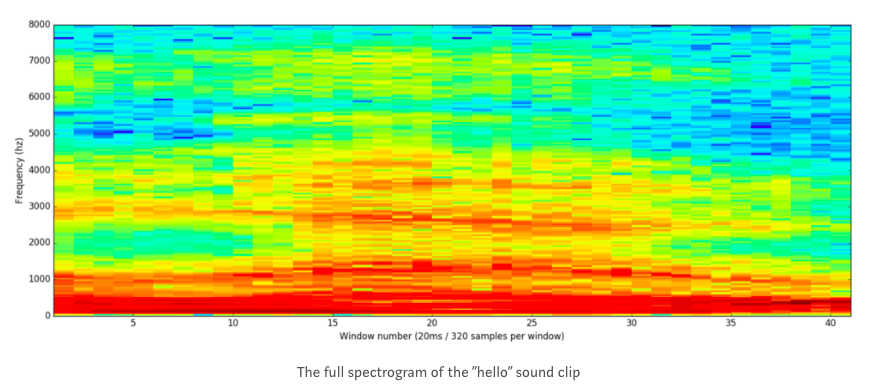
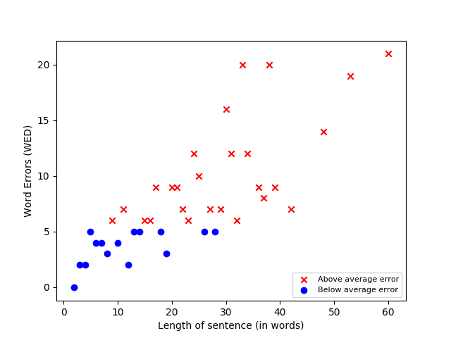

# End-to-end automatic speech recognition (ASR) using 1D convolutional neural network

**Author:** Ashwin Mishra\
**Date:** May 2019

This is an application written in Python that translates human voice to text. It uses the deep learning toolkit [TensorFlow](https://www.tensorflow.org/tutorials/images/cnn) to create and train a convolutional neural network. Unlike hidden Markov models (HMM), this application uses letters (graphemes) to train the network instead of phonetic transcriptions (phonemes). This application was built as a part of my senior capstone project at Youngstown State University.

## Digitizing analog waves

First step in speech processing is converting analog audio waves into digital data. Therefore, it first transforms the speech signal into a power spectrum. A power spectrogram is a 2-D array of the size `(x, y)` where `x` = length of audio and `y` = mel size. To transform audio files into power spectrogram, `librosa` was used. [Librosa](https://librosa.org/doc/latest/index.html) is a python library built for music and audio analysis. 

 
Fig: 2-D array transformation for the spectrogram

## Connectionist Temporal Classification (CTC)

- There needs to be an equal number of input `x`'s and output `y`'s.

**Problem:** Most of the time, input `x` is a lot larger than the output text `y`. This is generally the case when the audio sample is too long with too many pauses in it but the actual text is only a few words.

**Solution:** Collapse repeated characters not separated by blank into on character.

`ttt_h_eee___ ___qqq __`
The above output is equivalent to `The q`.

## Training (speech recognition)

A convolutional neural network of 29 classes was created. CTC Greedy decoding was used to decode and predict the output. The weights were stored during the training process as checkpoints which were accessed during the testing process to decode the `test` audio samples. Finally to analyze the statistics, Letter Edit Distance (LED) and Word Edit Distance (WED) were calculated to determine the accuracy.

The [LibriSpeech](http://www.openslr.org/12) ASR corpus extracted from OpenSLR was used to train and test the network. It provided 1000 hours of audio with perfectly aligned audio transcript.

After the model ran on the test data from LibriSpeech dataset, the following results were obtained.

## Testing (live recording)

For live recording, `PyAudio` was used to record the speech and then it was transformed into Power Spectrogram fragments. Finally, decoding was done using CTC Greedy Decoder and the raw string was converted into a sentence structure.

## Reference

Based on the Wav2Letter model developed at Facebook AI Research (https://github.com/facebookresearch/wav2letter), (https://arxiv.org/pdf/1609.03193.pdf).
